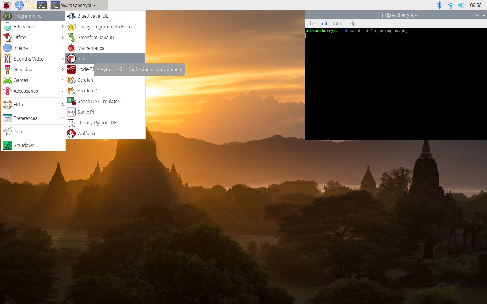
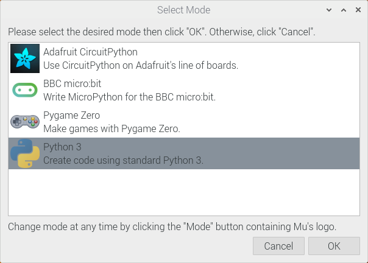

## Opening Mu

--- task ---
Open Mu from your application menu.

--- /task ---

--- task ---
You can then choose the mode you want to use. Choose **Python 3** if you are creating a new Python script.

--- /task ---
